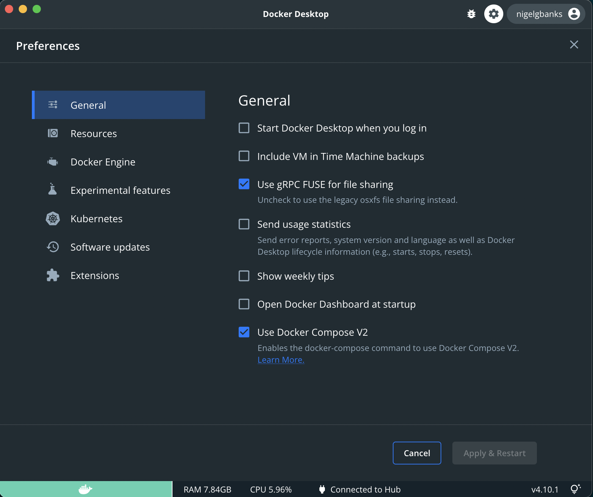
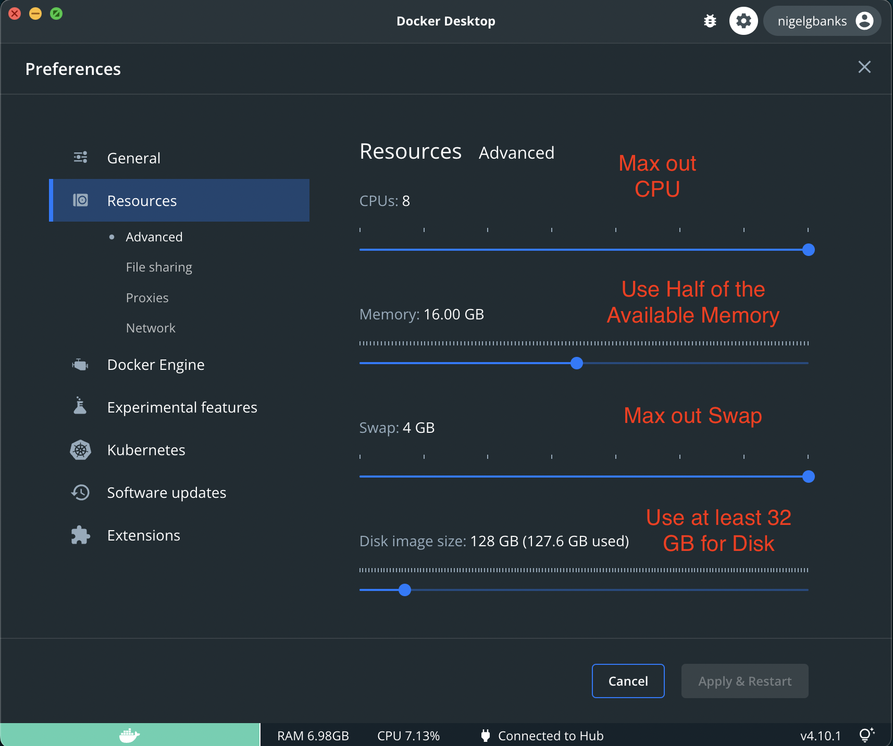

# IslandoraCon 2022 - Example Project  <!-- omit in toc -->

[](./LICENSE)

- [Introduction](#introduction)
- [Requirements](#requirements)
- [Running](#running)
- [Removing](#removing)

## Introduction

This repository is a simple example for use at Islandora Con 2022 it is meant to
be as minimal and cross platform as possible to limit hiccups.

If you are looking to use islandora please read the [official documentation] and
use either [isle-dc] to deploy via Docker or the [islandora-playbook] to deploy
via Ansible.

## Requirements

To run locally only the following are required:

- [Docker 19.03+](https://docs.docker.com/get-docker/)

If using Docker Desktop ensure that Docker Compose V2 is enabled:



And be sure you have the resources set to reasonable values:



## Running

To run locally use the command:

```bash
docker compose pull &; docker compose down -v &; wait; docker compose up -d; docker logs -f drupal
```

When the log output shows:

```bash
#####################
# Install Completed #
#####################
```

It is ready to use. 

To stop the log output press `CTRL-C`.

The following URLs are accessible:

| URL                            | Description                                                                                                    |
| :----------------------------- | :------------------------------------------------------------------------------------------------------------- |
| <http://activemq.traefik.me>   | The ActiveMQ administrative console.                                                                           |
| <http://blazegraph.traefik.me> | The BlazeGraph TripleStore administrative console.                                                             |
| <http://drupal.traefik.me>     | The Drupal website.                                                                                            |
| <http://ide.traefik.me>        | The in browser editor for exploring the code base and interacting with drupal via `drush` and `drupal` console |
| <http://solr.traefik.me>       | The Solr search engine administrative console.                                                                 |
| <http://traefik.traefik.me>    | The Traefik router administrative console.                                                                     |


## Removing

To remove the environment use the following command:

```bash
docker compose down -v
```

[islandora-playbook]: https://github.com/Islandora-Devops/islandora-playbook
[isle-dc]: https://github.com/Islandora-Devops/isle-dc
[official documentation]: https://islandora.github.io/documentation/